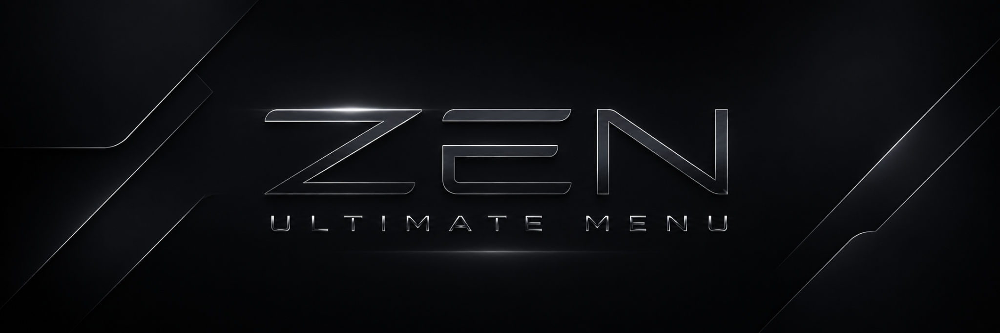
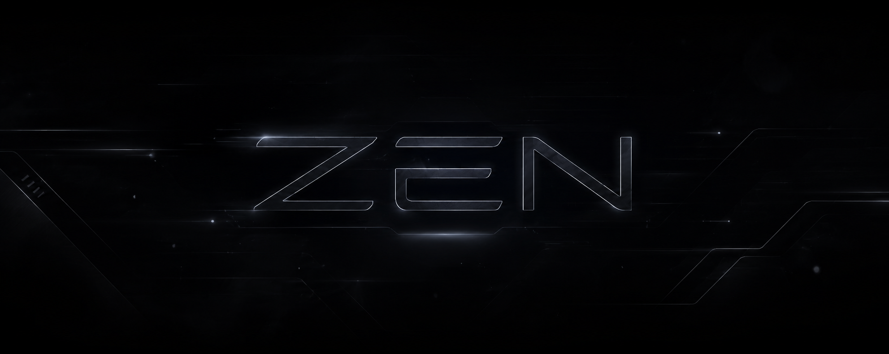

<div align="center">



<br>

# ZEN MENU

### Dark Windows utility hub with plugins, automation, local AI, media tools, soundboard, dashboard widgets and developer tools.

<br>


<br>


<br>

```txt
[ ACCESS GRANTED ]
[ ZEN CORE INITIALIZED ]
[ THANKS FOR USING CRX ]
```

</div>

---

# ZEN MENU

**ZEN MENU** is a dark Windows desktop utility app made with **Python** and **CustomTkinter**.

It works as a personal control center for system tools, plugins, local AI, media conversion, Discord/Spotify status, developer utilities, soundboard, themes and automation.

The goal of ZEN MENU is to keep many useful tools in one clean interface:

- System cleaning
- File organization
- Discord / Spotify Rich Presence
- Local ZENAI with Ollama
- Plugin system
- Soundboard
- FFmpeg media tools
- GitHub tools
- EXE builder
- Windows repair tools
- Startup apps manager
- Dashboard widgets
- Theme customization
- Config profiles
- Macro builder
- Visual flow builder
- Text transformer
- Game overlay
- Floating widgets
- Plugin store
- Setup wizard

---

# Preview

<div align="center">



<br><br>


</div>

---

# Main Features

```txt
Dashboard
Setup Wizard
Command Palette
Global Search
Plugin Store
ZENAI Local Assistant
Soundboard
Theme Preview
Appearance Studio
Config Profiles
Macro Builder
Visual Flow Builder
Mini Apps
Game Overlay
Level System
Usage Heatmap
Time Tracker
Text Transformer
EXE Builder
GitHub Tools
FFmpeg Tools
Cleaner
File Organizer
Discord / Spotify Rich Presence
```

---

# Folder Structure

Keep this structure:

```txt
ZEN MENU/
├─ main.py
├─ config.json
├─ requirements.txt
├─ install_requirements.bat
├─ build_exe.bat
├─ README.md
├─ README.txt
├─ CHANGELOG.md
├─ assets/
│  ├─ banners/
│  │  ├─ zen_banner.png
│  │  └─ discord_banner.png
│  ├─ icons/
│  │  └─ app.ico
│  ├─ images/
│  │  └─ zen.png
│  └─ sounds/
│     ├─ startup.wav
│     ├─ click.wav
│     ├─ success.wav
│     ├─ error.wav
│     └─ notification.wav
├─ modules/
├─ plugins/
├─ config_profiles/
├─ update_backups/
└─ crash_logs/
```

When you build the `.exe`, keep this next to the executable:

```txt
dist/
├─ ZEN MENU.exe
├─ config.json
├─ assets/
├─ plugins/
├─ README.txt
└─ CHANGELOG.md
```

If `assets/`, `plugins/` or `config.json` are missing beside the `.exe`, some features may not work.

---

# Full Installation Tutorial

This section explains everything needed to run all modules from ZEN MENU.

---

## 1. Install Python

ZEN MENU needs:

```txt
Python 3.10 or newer
```

Download Python:

```txt
https://www.python.org/downloads/windows/
```

During installation, enable:

```txt
Add Python to PATH
```

After installing, open CMD and test:

```bat
python --version
```

You should see something similar to:

```txt
Python 3.11.x
```

Then test pip:

```bat
python -m pip --version
```

If both commands work, Python is ready.

---

## 2. Install Python Requirements

Inside the ZEN MENU folder, run:

```bat
install_requirements.bat
```

Or install manually:

```bat
python -m pip install --upgrade pip setuptools wheel
python -m pip install -r requirements.txt
```

Then run the app:

```bat
python main.py
```

---

# requirements.txt

Create or replace `requirements.txt` with this:

```txt
customtkinter
psutil
pypresence
keyboard
pyperclip
send2trash
Pillow
pyautogui
pycaw
comtypes
rich
spotipy
syncedlyrics
pystray
winotify
requests
```

---

# install_requirements.bat

Run install_requirements.bat on your ZEN MENU folder and it will install all the requirements

---

# 3. Install Git

Git is needed for:

```txt
GitHub Tools
Project Maker
Commit tools
Repository tools
Update workflows
```

Download Git:

```txt
https://git-scm.com/download/win
```

Install it using the default options.

After installing, open a new CMD and test:

```bat
git --version
```

If it shows the version, Git is ready.

---

# 4. Install FFmpeg

FFmpeg is needed for:

```txt
Clip Compressor
Audio Converter
Video to GIF
Advanced Converters
Media tools
Sound workflows
```

Download FFmpeg Windows build:

```txt
https://www.gyan.dev/ffmpeg/builds/
```

Download:

```txt
ffmpeg-release-essentials.zip
```

Extract the ZIP.

Rename the extracted folder to:

```txt
ffmpeg
```

Move it to:

```txt
C:\ffmpeg
```

The final path should be:

```txt
C:\ffmpeg\bin\ffmpeg.exe
```

Now add FFmpeg to PATH.

Open:

```txt
Start Menu > Search > Environment Variables
```

Then:

```txt
Edit the system environment variables
Environment Variables
Path
Edit
New
```

Add:

```txt
C:\ffmpeg\bin
```

Click OK on everything.

Close CMD and open a new CMD.

Test:

```bat
ffmpeg -version
```

If FFmpeg version appears, it is ready.

---

# 5. Install Ollama for ZENAI

Ollama is needed for:

```txt
ZENAI local AI
Local assistant
Offline AI chat
AI config help
```

Download Ollama:

```txt
https://ollama.com/download/windows
```

Install it.

Then open CMD and run:

```bat
ollama pull llama3.1
```

Test:

```bat
ollama list
```

In `config.json`, keep:

```json
"zenai": {
  "enabled": true,
  "provider": "ollama",
  "model": "llama3.1",
  "ollama_url": "http://127.0.0.1:11434/api/generate"
}
```

If your PC is weaker, install a smaller model:

```bat
ollama pull llama3.2:1b
```

Then change:

```json
"model": "llama3.2:1b"
```

---

# 6. Install VB-CABLE for Soundboard Microphone Mode

This is needed if you want the ZEN MENU Soundboard to work like Voicemod.

Download VB-CABLE:

```txt
https://vb-audio.com/Cable/
```

Install it and restart your PC if needed.

## Basic Setup

Set Windows output device to:

```txt
CABLE Input
```

Set Discord / voice chat input device to:

```txt
CABLE Output
```

Then open ZEN MENU and go to:

```txt
Soundboard
```

Play sounds.

The sounds should go through the virtual microphone.

## Important

With basic VB-CABLE, all Windows audio may go to the virtual cable depending on your audio settings.

For advanced control, use:

```txt
Voicemeeter
```

---

# 7. Install Node.js and Vercel CLI

This is needed for:

```txt
ZEN Vercel Helper
Next.js deploys
Website deploy tools
```

Download Node.js:

```txt
https://nodejs.org/
```

After installing, test:

```bat
node --version
npm --version
```

Install Vercel CLI:

```bat
npm install -g vercel
```

Test:

```bat
vercel --version
```

---

# 8. Install PyInstaller

PyInstaller is needed for:

```txt
EXE Builder
Visual EXE Builder
build_exe.bat
```

Install:

```bat
python -m pip install pyinstaller
```

Test:

```bat
python -m PyInstaller --version
```

---

# Running ZEN MENU

After installing requirements, run:

```bat
python main.py
```

If the app opens, everything is working.

---

# Building ZEN MENU as EXE

Run:

```bat
build_exe.bat
```

Recommended options:

```txt
Build mode: onefile
Window mode: windowed
Clean build: yes
Icon: assets\icons\app.ico
```

After build, open:

```txt
dist/
```

Keep these beside the `.exe`:

```txt
config.json
assets/
plugins/
CHANGELOG.md
README.txt
```

---

# Main Pages

## Dashboard

The Dashboard is the main home screen.

It includes:

```txt
ZEN banner
Simple / Advanced mode
Module search
Status cards
ZENAI tip
Pinned modules
Focus View
```

Use it to quickly open the most important modules.

---

## Setup Wizard

The Setup Wizard helps you configure the app.

It checks:

```txt
config.json
assets/
FFmpeg
Git
Ollama
Spotify
```

Open this page after installing the app for the first time.

---

## Command Palette

Fast module launcher.

Examples:

```txt
music
plugins
cleaner
soundboard
ffmpeg
exe
settings
```

Use this when you know what you want to open but do not want to search the sidebar.

---

## Global Search

Searches:

```txt
Modules
Plugins
Config keys
Help content
```

Good for finding pages, plugins or settings fast.

---

## Appearance Studio

Controls:

```txt
Skin
Theme
Focus View
Sound test
Banner
Visual identity
```

Use this page to customize the visual identity of the app.

---

## Help Center

Includes guides for:

```txt
FFmpeg
Ollama
Spotify
Plugins
EXE build
VB-CABLE
```

---

## Plugin Store

Shows plugins as cards.

Plugins are loaded from:

```txt
plugins/
```

---

## Soundboard

Plays `.wav` files from:

```txt
assets/sounds/
```

To use it as microphone audio, configure VB-CABLE.

---

## ZENAI

Uses Ollama local AI.

Make sure Ollama is installed and a model is pulled.

Example:

```bat
ollama pull llama3.1
```

---

## Config Profiles

Save and load different `config.json` profiles.

Useful for:

```txt
Gaming setup
Coding setup
Minimal setup
Testing setup
```

---

## Macro Builder

Create simple action chains:

```txt
open_url
open_folder
run_command
wait
notify
```

Example macro:

```txt
Open Discord
Open Steam
Wait 3 seconds
Notify Gaming mode started
```

---

## Flow Builder

Create readable automation flows:

```txt
Start
Open App
Wait
Run Command
Notify
End
```

---

## Mini Apps

Includes:

```txt
Mini Notes
Mini Clock
Mini System Monitor
```

---

## Game Overlay

Always-on-top overlay with:

```txt
Time
CPU
RAM
ZEN status
```

This is not injected into games. It is a normal topmost overlay window.

---

## Theme Preview

Preview:

```txt
Cards
Buttons
Textboxes
Headers
```

---

## Level System

Shows XP and level.

It is mostly cosmetic, but helps make the app feel more alive.

---

## Usage Heatmap

Shows most-used modules.

Example:

```txt
Cleaner        ██████████
Plugins        ███████
Music          █████
ZENAI          ████
Settings       ██
```

---

## Time Tracker

Tracks current session time.

Useful to see how long the app has been open.

---

## Text Tools

Transforms text:

```txt
UPPERCASE
lowercase
Title Case
snake_case
kebab-case
remove accents
```

---

# Plugins

Plugins are stored in:

```txt
plugins/
```

Each plugin should have:

```txt
plugin.json
main.py
README.md
```

Example:

```txt
plugins/
└─ my_plugin/
   ├─ plugin.json
   ├─ main.py
   └─ README.md
```

Example `plugin.json`:

```json
{
  "name": "My Plugin",
  "entry": "main.py",
  "description": "My custom ZEN plugin.",
  "version": "1.0.0",
  "author": "Zen"
}
```

Example `main.py`:

```python
import tkinter as tk
from tkinter import messagebox

def main():
    root = tk.Tk()
    root.title("My Plugin")
    root.geometry("400x220")

    tk.Label(root, text="My Plugin", font=("Segoe UI", 18, "bold")).pack(pady=20)
    tk.Button(root, text="Run", command=lambda: messagebox.showinfo("Plugin", "Running!")).pack(pady=10)

    root.mainloop()

if __name__ == "__main__":
    main()
```

---

# Included Plugins

Depending on your build, plugins may include:

```txt
ZEN Wallpaper Changer
ZEN Roblox Tools
ZEN Steam Tools
ZEN Browser Cleaner
ZEN Vercel Helper
ZEN Badge Generator
ZEN Portfolio Builder
ZEN Clip Compressor
ZEN Audio Converter
ZEN Banner Maker
ZEN Sound Pack Installer
ZEN App Skin Manager
ZEN Project Scanner
ZEN Auto Updater Plugin
ZEN Plugin Creator
```

---

# Config File

Main config:

```txt
config.json
```

Important sections:

```json
{
  "ui_sounds": true,
  "theme": {
    "app_name": "ZEN MENU",
    "background": "#020203",
    "panel": "#0a0b0e",
    "panel2": "#050609",
    "line": "#252730",
    "text": "#f8f8fa",
    "muted": "#9fa2ad",
    "button": "#171920",
    "button_hover": "#252833",
    "accent": "#ffffff"
  },
  "appearance": {
    "skin": "CRX Terminal Fade",
    "banner": "assets/banners/zen_banner.png",
    "discord_banner": "assets/banners/discord_banner.png",
    "startup_intro": true,
    "terminal_intro_text": "Thanks for using CRX!"
  },
  "dashboard": {
    "mode": "Advanced",
    "show_banner": true,
    "show_status_cards": true,
    "show_zenai_tip": true
  }
}
```

---

# Spotify Setup

Spotify is used for:

```txt
Music Widget
Discord Spotify Status
Lyrics Sync
```

You need a Spotify Developer app.

Use redirect URI:

```txt
http://127.0.0.1:8888/callback
```

Put credentials in `config.json`:

```json
"spotify": {
  "enabled": true,
  "client_id": "YOUR_CLIENT_ID",
  "client_secret": "YOUR_CLIENT_SECRET",
  "redirect_uri": "http://127.0.0.1:8888/callback",
  "show_lyrics": true
}
```

Do not upload your real Spotify secret to GitHub.

---

# Discord Rich Presence Setup

You need a Discord Application ID.

Put it in `config.json`:

```json
"discord": {
  "enabled": true,
  "client_id": "YOUR_DISCORD_APPLICATION_ID"
}
```

Discord desktop app must be open.

---

# Safe Mode

Open ZEN MENU in Safe Mode:

```bat
python main.py --safe
```

Or:

```bat
ZEN MENU.exe --safe
```

Safe Mode is useful if something breaks.

---

# Troubleshooting

## Python is not recognized

Reinstall Python and enable:

```txt
Add Python to PATH
```

Test:

```bat
python --version
```

---

## pip install fails

Run:

```bat
python -m pip install --upgrade pip setuptools wheel
python -m pip install -r requirements.txt
```

---

## FFmpeg not found

Test:

```bat
ffmpeg -version
```

If it fails, add this to PATH:

```txt
C:\ffmpeg\bin
```

Then open a new CMD.

---

## Ollama not working

Test:

```bat
ollama list
```

If it fails, open Ollama or reinstall it.

Then run:

```bat
ollama pull llama3.1
```

---

## Soundboard does not play through microphone

Install VB-CABLE and configure:

```txt
Windows Output: CABLE Input
Discord Input: CABLE Output
```

Then play sounds in ZEN MENU.

---

## Theme does not change

Save the theme and restart the app.

---

## Startup sound does not play

Check if this file exists:

```txt
assets/sounds/startup.wav
```

Also check:

```json
"ui_sounds": true
```

---

## EXE opens but assets are missing

Keep this next to the `.exe`:

```txt
assets/
config.json
plugins/
```

---

## Plugin does not appear

Check if the folder has:

```txt
plugin.json
main.py
```

Then restart the app or reload plugins.

---

## App crashes immediately

Run from CMD:

```bat
python main.py
```

This shows the real error.

You can also try:

```bat
python main.py --safe
```

---

# Recommended First-Time Setup

```txt
1. Install Python
2. Run install_requirements.bat
3. Install Git
4. Install FFmpeg
5. Install Ollama
6. Run ollama pull llama3.1
7. Install VB-CABLE if you want Soundboard microphone mode
8. Install Node.js and Vercel CLI if you use deploy tools
9. Run python main.py
10. Open Setup Wizard
11. Run Health Check
12. Configure Spotify and Discord
13. Open Plugin Store
14. Build EXE if needed
```

---

# Security Notes

Do not upload real secrets to GitHub.

Avoid uploading:

```txt
config.json with secrets
.env
tokens.txt
passwords.txt
Spotify client_secret
API keys
private keys
```

Use:

```txt
config.example.json
```

for public repositories.

---

# Credits

Created by Zen / superstandarts.

Discord:

```txt
7mey
```

GitHub:

```txt
https://github.com/superstandarts
```

<div align="center">

<br>


<br>

```txt
[ ZEN MENU ]
[ SYSTEM ONLINE ]
[ THANKS FOR USING CRX ]
```

</div>
